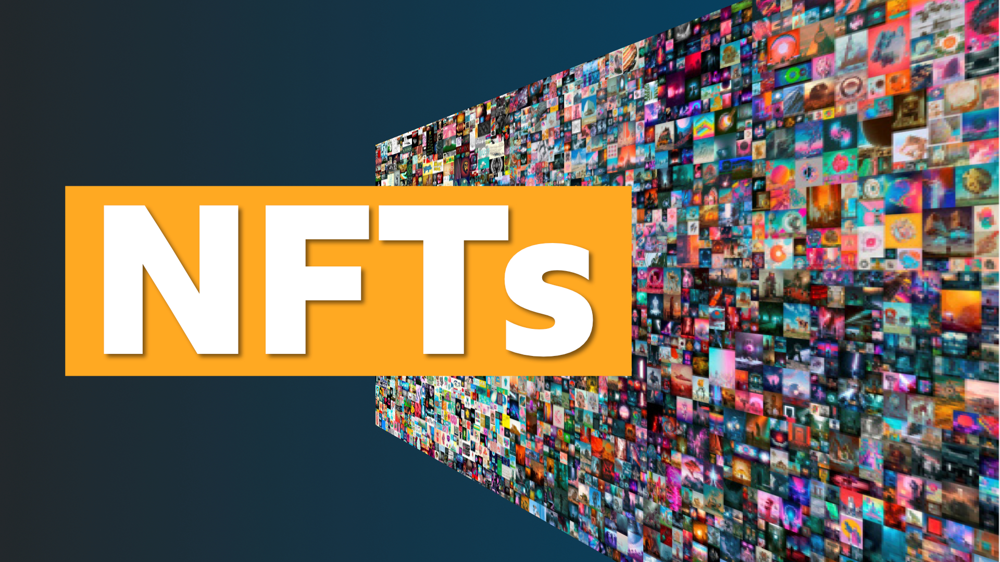

# The  Random IPFS NFT and SVG NFT




*This repo has been updated to work with Sepolia over Goerli.*

RandomIpfsNft Contract CODE: https://sepolia.etherscan.io/address/0x52784253C6f8f3769482C3B66131A10E36C3C3B0#code

DynamicSvgNft Contract CODE: https://sepolia.etherscan.io/address/0xC4Fb0c61fd0Be3D05eD23f89F53a0D8A52119E8A

We go through creating 3 different kinds of NFTs.

1. A Basic NFT
2. IPFS Hosted NFT 
   1. That uses Randomness to generate a unique NFT
3. SVG NFT (Hosted 100% on-chain) 
   1. Uses price feeds to be dynamic


3 contracts

1. Basic NFT(ERC721) ✅
2. Random IPFS NFT(host on IPFS) ✅
- Pros: Cheap
- Cons: Someone need to pin our data

3. Dynamic SVG NFT(host on on-Chain) ✅
- Pros: The data is on chain
- Cons: Much more expensive

if price of ETH is above X -> Happy face
if it's blow -> Frown face

# Getting Started

## Requirements

- [git](https://git-scm.com/book/en/v2/Getting-Started-Installing-Git)
  - You'll know you did it right if you can run `git --version` and you see a response like `git version x.x.x`
- [Nodejs](https://nodejs.org/en/)
  - You'll know you've installed nodejs right if you can run:
    - `node --version` and get an ouput like: `vx.x.x`
- [Yarn](https://yarnpkg.com/getting-started/install) instead of `npm`
  - You'll know you've installed yarn right if you can run:
    - `yarn --version` and get an output like: `x.x.x`
    - You might need to [install it with `npm`](https://classic.yarnpkg.com/lang/en/docs/install/) or `corepack`

## Quickstart

```
git clone https://github.com/Solidityarchitect/hardhat-nft
cd hardhat-nft
yarn
```


# Usage

Deploy:

```
yarn hardhat deploy
```

## Testing

```
yarn hardhat test
```

### Test Coverage

```
yarn hardhat coverage
```


